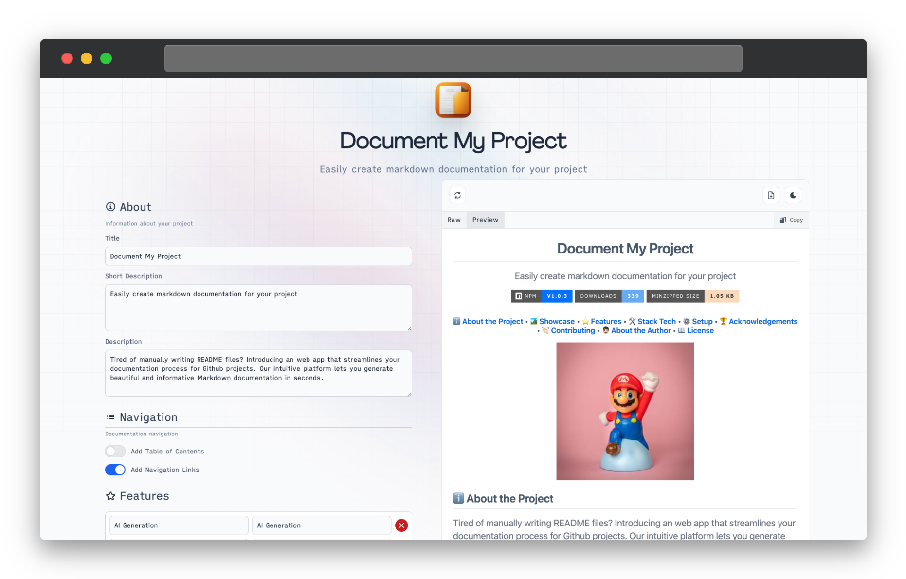
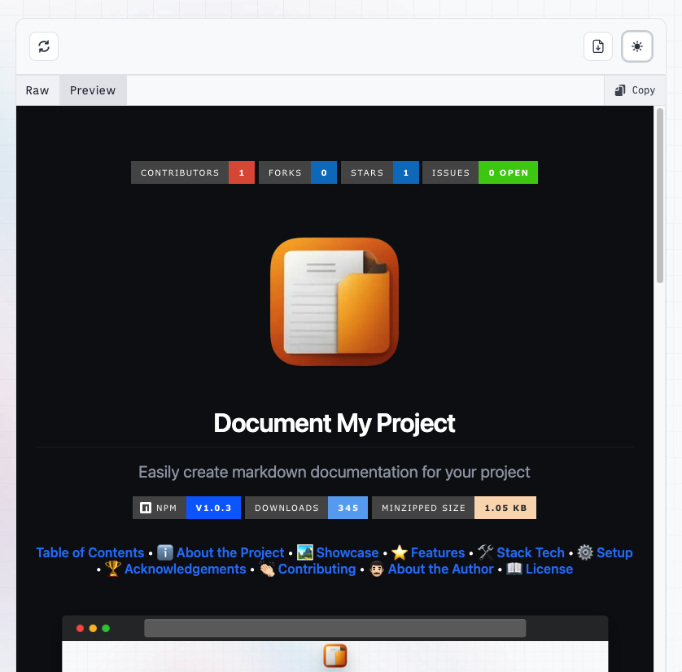
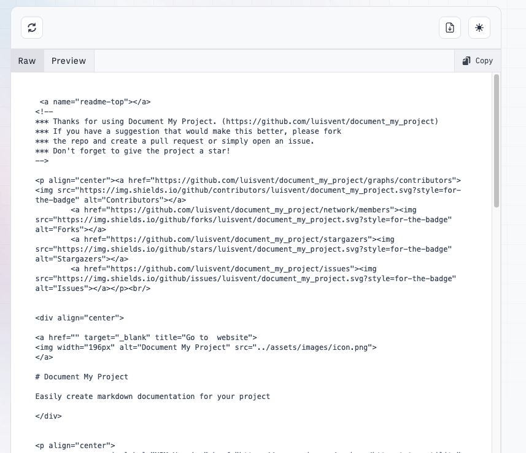
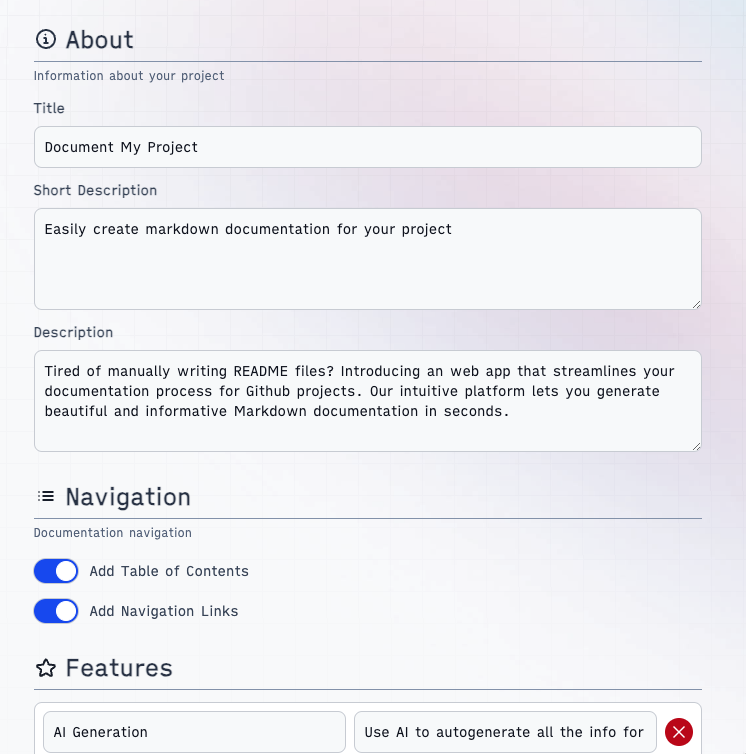
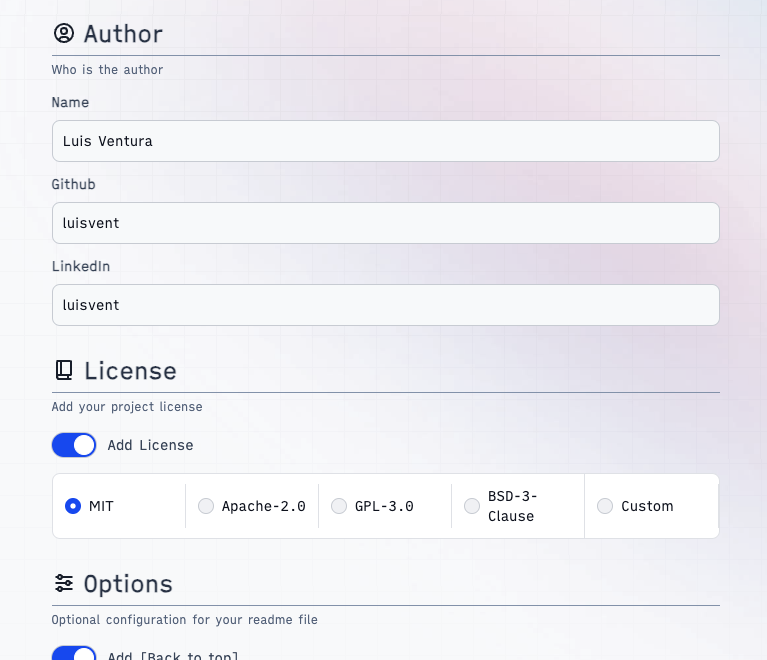

<!--
*** Thanks for using Document My Project. (https://github.com/luisvent/document_my_project) 
*** If you have a suggestion that would make this better, please fork  
*** the repo and create a pull request or simply open an issue.
*** Don't forget to give the project a star!
-->

        
        
        
 

# Document My Project

Easily create markdown documentation for your project

<h4><a href="#-about-the-project">ℹ️ About the Project</a> • <a href="#-showcase">🏞 Showcase</a> • <a href="#-features">⭐️ Features</a> • <a href="#-stack-tech">🛠 Stack Tech</a> • <a href="#-setup">⚙ ️Setup</a> • <a href="#-acknowledgements">🏆 Acknowledgements</a> • <a href="#-contributing">👏🏻 Contributing</a> • <a href="#-about-the-author">👨🏻‍ About the Author</a> • <a href="#-license">📖 License</a></h4>

## ️Table of Contents

 

Open Contents

- [Document My Project](#document-my-project)
    - [ℹ️ About the Project](#-about-the-project)
    - [🏞 Showcase](#-showcase)
    - [⭐️ Features](#-features)
    - [🛠 Stack Tech](#-stack-tech)
    - [⚙ ️Setup](#-setup)
        - [Installation](#installation)
        - [Usage](#usage)
    - [🏆 Acknowledgements](#-acknowledgements)
    - [👏🏻 Contributing](#-contributing)
        - [Ways to Contribute](#ways-to-contribute)
        - [Contribution Instructions](#contribution-instructions)
        - [Contributors](#contributors)
    - [👨🏻‍ About the Author](#-about-the-author)
    - [📖 License](#-license)

## ℹ️ About the Project

Tired of manually writing README files? this tool simplifies the process of creating documentation for Github projects.
With just a few clicks, you can generate comprehensive documentation that enhances the visibility and usability of your
repositories in seconds.

## 🏞 Showcase

 

<table>
<tr>
<td></td>
<td></td>
</tr>
<tr>
<td></td>
<td></td>
</tr>
</table>

## ⭐️ Features

1. **Template ready**

Provide a clear and concise description of your project, highlight the main features, goals, and benefits of your
project

2. **Ease fo use**

Easily generate a well-structured README file for your GitHub project

3. **Preview**

Preview the generated README (light/dark theme) file before committing it to your repository

## 🛠 Stack Tech

- [![Angular][Angular-badge]][Angular-url] - A front-end web application framework

[Angular-badge]: https://img.shields.io/badge/Angular-DD0031?style=for-the-badge&logo=angular

[Angular-url]: }

- [![NgRx][NgRx-badge]][NgRx-url] - Angular state management based on Redux

[NgRx-badge]: https://img.shields.io/badge/NgRx-B7116E?style=for-the-badge&logo=ngrx

[NgRx-url]: }

- [![Tailwind CSS][Tailwind CSS-badge]][Tailwind CSS-url] - Utility-first CSS framework

[Tailwind CSS-badge]: https://img.shields.io/badge/Tailwind%20CSS-38B2AC?style=for-the-badge&logo=tailwindcss

[Tailwind CSS-url]: }

- [![TypeScript][TypeScript-badge]][TypeScript-url] - A strict syntactical superset of JavaScript

[TypeScript-badge]: https://img.shields.io/badge/TypeScript-3178C6?style=for-the-badge&logo=typescript

[TypeScript-url]: }

## ⚙ ️Setup

### Installation

To install this project, follow these steps:

1. Install Node.js v16 or later

2. Install the required dependencies:

3. `npm install`

### Usage

After installation, you can use the project by following these steps:

1. Open the project directory in your code editor

2. Run `npm run start` to start the development server

## 🏆 Acknowledgements

- [ngx-markdown](https://www.npmjs.com/package/ngx-markdown) - Angular markdown component/directive/pipe/service to
  parse static, dynamic or remote content to HTML with syntax highlight and more
- [Flowbite](https://flowbite.com/) - Build websites even faster with components on top of Tailwind CSS
- [PrismJs](https://prismjs.com/) - Prism is a lightweight, extensible syntax highlighter, built with modern web
  standards in mind. It’s used in millions of websites, including some of those you visit daily.

## 👏🏻 Contributing

We welcome contributions from the community! If you would like to contribute to this project, please follow the
guidelines below.

### Ways to Contribute

- Report bugs or issues by opening a new issue on our GitHub repository.
- Suggest new features or improvements by opening a new issue on our GitHub repository.
- Contribute code by forking the repository, making changes, and submitting a pull request.

### Contribution Instructions

1. Fork the repository.
2. Create a new branch for your feature or bug fix: `git checkout -b my-feature-branch`.
3. Make the necessary changes and commit them: `git commit -am 'Add my new feature'`.
4. Push your branch to your forked repository: `git push origin my-feature-branch`.
5. Open a pull request against the main repository, describing the changes you made and why they should be merged.

### Contributors

- Luis Ventura (@luisvent)

## 👨🏻‍ About the Author

**Luis Ventura**

This project was created by Luis Ventura. Connect with me on [GitHub](https://github.com/luisvent)
and [LinkedIn](https://www.linkedin.com/in/luisvent/) to learn more about my projects and professional background.

## 📖 License

This project is licensed under the [MIT License](https://opensource.org/licenses/MIT).

<a href="#readme-top">Top ⬆️</a>

---
 
Built with ❤️ with <a href="https://github.com/luisvent/document_my_project">Document My Project</a>

